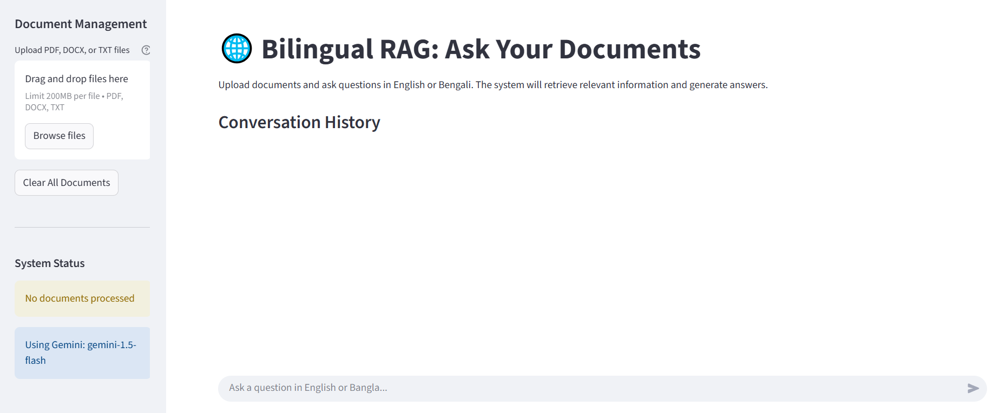
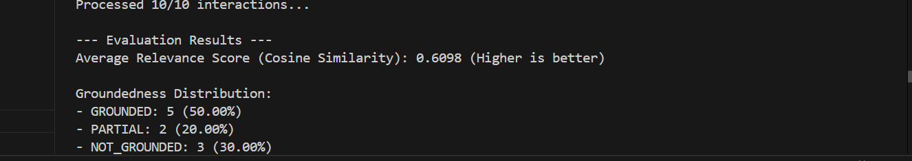

# 🤖 ragBE - Bilingual Retrieval-Augmented Generation (RAG) System


**ragBE** (Retrieval-Augmented Generation - Bilingual) is a powerful and user-friendly RAG system designed for conversational Q&A in both **English** and **Bengla**.. Built using the **Google Gemini LLM** and orchestrated with **LangChain**, **ragBE** offers robust document ingestion (supporting **PDF, DOCX, and TXT files**), intelligent semantic search powered by multilingual embeddings (from paraphrase-multilingual-MiniLM-L12-v2), and efficient knowledge storage in **ChromaDB**.

 ## 🚀 Live Demo
Experience RagBi live on Streamlit Community Cloud!

**[👉 Launch RagBi App](https://ragbe0.streamlit.app/)**



## 🌟 Key Features

-   🔤 **Bilingual Q&A**: Understands and answers queries in both **English and Bengali**, providing a seamless conversational experience.
-   📂 **Flexible Document Support**: Effortlessly ingests knowledge from various document formats, including **PDF, DOCX, and TXT files**.
-   🧠 **Gemini LLM Integration**: Powered by the **Google Gemini LLM** via LangChain for intelligent and contextual response generation.
-   🔍 **Semantic Search with Multilingual Embeddings**: Leverages advanced **multilingual embedding models** (like `paraphrase-multilingual-MiniLM-L12-v2`) for highly accurate, language-agnostic information retrieval.
-   🗄️ **Vector Store**: Efficiently stores and retrieves document embeddings using **ChromaDB**, ensuring fast access to relevant information.
-   ✂️ **Text Chunking**: Optimizes document processing by splitting text into meaningful chunks that preserve contextual meaning for better retrieval.
-   🌐 **Interactive Streamlit Interface**: Provides a user-friendly web application for seamless document upload, management, and real-time conversational chat.
-   🔌 **Flexible FastAPI Backend**: Offers robust REST API endpoints for easy integration with other applications and headless interaction.
-   📊 **Automated Evaluation Toolkit**: Includes comprehensive metrics and scripts for assessing the **Groundedness** (factual support) and **Relevance** (appropriateness of retrieved documents) of responses.

---

## 🚀 Setup Guide

### 🛠 Prerequisites

- Python 3.9+
- Git
- Poppler (PDF to image converter)
- Tesseract OCR with Bengali language model (`ben.traineddata`)

### 🧱 Installation Steps

```bash
git clone https://github.com/Goffar-dp/ragBE.git
cd ragBE
python -m venv venv
source venv/bin/activate  # or .\venv\Scripts\activate on Windows
pip install -r requirements.txt
```

### 🔐 Configure API Key

Create a file called `gemini_api.yml`:

```yaml
api:
  api_key: YOUR_GEMINI_API_KEY
```

Ensure it's listed in `.gitignore`.

---

## 📥 Document Ingestion & Preprocessing

-   **PDFs**: Processed using `pypdf` for direct text extraction. For scanned or image-based PDFs, a fallback **OCR** mechanism is employed, converting pages to images via `pdf2image` and then extracting text using `pytesseract`.
-   **DOCX**: Handled robustly using the `python-docx` library for extracting content.
-   **TXT**: Directly ingested by reading the file content with UTF-8 encoding.
-   **Bilingual Text Handling**: `langdetect` is used to identify the language of the extracted text, ensuring appropriate processing and response generation. OCR specifically supports Bengali text recognition.
-   **Intelligent Text Chunking**: Documents are broken down into semantically coherent units using LangChain's `RecursiveCharacterTextSplitter`. This strategy prioritizes larger structural elements (like paragraphs) before splitting by sentences or characters, with configurable `chunk_size` and `chunk_overlap` to maintain context for effective semantic retrieval.

---

## 🔍 Embedding & Retrieval

-   **Embedding Model**: We utilize the `sentence-transformers/paraphrase-multilingual-MiniLM-L12-v2` model. This model was specifically chosen for its **multilingual capabilities**, allowing it to generate high-quality, semantically rich embeddings for both English and Bengali text. This ensures that queries and document chunks are represented meaningfully in a shared vector space, regardless of their original language.
-   **Similarity Metric**: **Cosine Similarity** is employed to measure the semantic closeness between the user's query embedding and the embeddings of the stored document chunks. This metric effectively determines how similar two pieces of text are in meaning, making it ideal for semantic search.
-   **Vector Store**: All document chunk embeddings, along with their associated metadata (like source file and page numbers), are efficiently stored and managed within **ChromaDB**. This lightweight vector database provides fast and scalable storage for our knowledge base.
-   **Retrieval Mechanism**: For each user query, the system performs a **top-k semantic chunk matching** using LangChain's vector store retrievers. This process identifies and retrieves the `k` most semantically similar document chunks from ChromaDB, which are then passed to the LLM for answer generation.

---
## 🧰 Technologies Used

| Component      | Toolchain                        |
| -------------- | -------------------------------- |
| LLM            | Google Gemini + LangChain        |
| UI             | Streamlit                        |
| Backend        | FastAPI                          |
| Embeddings     | Sentence Transformers (`MiniLM`) |
| Vector DB      | ChromaDB +                       |
| OCR & Parsing  | pytesseract, PyMuPDF, docx2txt   |
| Language Tools | langdetect                       |
| Evaluation     | LLM-as-judge, cosine similarity  |
| Utilities      | pandas, numpy, hashlib, PyYAML   |

---

## 🧠 Query Processing Flow

1.  **Language Detection**: The user's query language (English or Bengali) is automatically detected using `langdetect`.
2.  **Semantic Retrieval**: The system performs a semantic search to retrieve the top `k` most relevant document chunks from the ChromaDB vector store based on the query.
3.  **Contextual Prompt Formatting**: The retrieved chunks are integrated into a context-aware prompt, which is then sent to the Large Language Model.
4.  **Response Generation**: The Google Gemini LLM processes the prompt and generates a comprehensive answer.
5.  **Answer Presentation**: The final answer is displayed to the user, accompanied by citations to the original source documents for transparency and verification.
---

## 🧪 Evaluation Metrics

**ragBE's** performance is rigorously assessed using an automated evaluation toolkit to ensure reliability and accuracy.
- 📌 **Groundedness**: Checks if answer is context-supported

- 📌 **Relevance**: Measures semantic similarity to query

To run the evaluation, execute the script:

```bash
python evaluate_rag.py
---


Based on the evaluation of 10 interactions, RagBi achieved an **Average Relevance Score of 0.6098**, indicating that the retrieved documents were generally quite pertinent to the queries. For **Groundedness**, 50% of responses were fully supported by the context, while 20% had partial support and 30% were not grounded. This highlights a strong foundation in relevance but also points to the need for further refinement to minimize ungrounded responses.
## 💬 Sample Queries

Here are some examples of how 🤖ragBE responds to qrueries in both English and Bengali:

> **BN:** অনুপমের বন্ধুর নাম কি?
>
> 🤖 "অনুপমের ছেলেবেলার বন্ধু হরিশ! সে কলকাতায় এসে লেখকের মন উতলা করেছে।"
>
> **EN:** Which model performed better
>
> 🤖 "  Based on the provided text, the stacking ensemble classifier achieved the highest accuracy at 97.88% when analyzing tabular data. While BioBERT performed well among NLP approaches (90.34% accuracy), and the Tree of Thought prompting on Claude Sonnet showed 75% accuracy, the stacking ensemble model outperformed them all. "

For a visual representation of sample queries and their outputs, refer to the image below:
Based on the evaluation of 10 interactions, RagBi achieved an **Average Relevance Score of 0.6098**, indicating that the retrieved documents were generally quite pertinent to the queries. For **Groundedness**, 50% of responses were fully supported by the context, while 20% had partial support and 30% were not grounded. This highlights a strong foundation in relevance but also points to the need for further refinement to minimize ungrounded responses.
 
 
Based on the evaluation of 10 interactions, RagBi achieved an **Average Relevance Score of 0.6098**, indicating that the retrieved documents were generally quite pertinent to the queries. For **Groundedness**, 50% of responses were fully supported by the context, while 20% had partial support and 30% were not grounded. This highlights a strong foundation in relevance but also points to the need for further refinement to minimize ungrounded responses.
---

## 🖥️ Local Execution

### 🧪 Streamlit UI

```bash
streamlit run app.py
```

Browse: [http://localhost:8501](http://localhost:8501)

### 🧪 FastAPI Backend

```bash
uvicorn api:app --reload --host 0.0.0.0 --port 8000
```

Docs: [http://localhost:8000/docs](http://localhost:8000/docs)
 

---

## 🧠 Implementation Insights

This section delves into the core technical decisions and methodologies behind RagBi, explaining the "why" behind each choice and the challenges encountered.

### 📌 What method/library was used to extract text and why? Did you face any formatting challenges with the PDF content?

For robust text extraction across diverse document types, RagBi employs a multi-faceted approach:
-   **PDFs:** Primarily, `pypdf` is used for direct, programmatic text extraction from standard PDF documents. This library is efficient for text-based PDFs.
-   **DOCX:** The `python-docx` library is utilized for parsing and extracting structured text content from Word documents, preserving basic formatting.
-   **TXT:** Simple UTF-8 encoding is used for direct ingestion of plain text files.

A significant challenge arises with **scanned PDFs or PDFs containing non-selectable text (e.g., images of text), especially in Bengali.** To overcome this, a robust **Optical Character Recognition (OCR)** fallback mechanism is implemented:
-   `pdf2image` is used to convert individual PDF pages into high-resolution images.
-   `pytesseract` (a Python wrapper for Google's Tesseract OCR engine) then processes these images to extract text.
-   **Bengali OCR:** `pytesseract` is configured with Bengali language packs (`tesseract-ocr-ben`) and Unicode-based language detection (`langdetect`) is employed to ensure accurate recognition and processing of Bengali characters.

**Formatting Challenges:** Yes, PDF content frequently presented significant formatting challenges. Issues included:
-   **Inconsistent Encodings:** Mixed character encodings leading to garbled text.
-   **Complex Layouts:** Multi-column articles, tables, and embedded images often resulted in text extracted out of logical reading order or with missing context.
-   **Scanned Quality:** The quality of OCR output is highly dependent on the scan resolution and clarity, which can introduce errors.
Our multi-pronged extraction strategy, particularly the OCR fallback, aims to maximize text recovery despite these inherent difficulties.

### 📌 What chunking strategy was used and why?

RagBi utilizes LangChain's `RecursiveCharacterTextSplitter` for its text chunking strategy.
-   **Mechanism:** This splitter operates by attempting to split text using a list of separators, starting with larger, more semantically meaningful ones (e.g., `"\n\n"` for paragraphs, then `"\n"` for lines, then spaces). If a chunk still exceeds the `chunk_size` after trying larger separators, it then recursively splits by smaller delimiters until the `chunk_size` is met.
-   **Bengali-Specific Delimiter:** Crucially, for Bengali text, the `।` (Danda - the Bengali full stop) is included in the list of separators. This ensures that Bengali sentences are respected as natural breaking points, maintaining semantic integrity within chunks.
-   **`chunk_size` and `chunk_overlap`:** We configure a specific `chunk_size` (e.g., 1000 characters) to ensure chunks are large enough to contain sufficient context but small enough to be semantically focused. A `chunk_overlap` (e.g., 200 characters) is also used, which creates redundancy between adjacent chunks.
-   **Why it works well for semantic retrieval:** This strategy is highly effective because:
    -   **Context Preservation:** It prioritizes keeping semantically related content together, preventing critical information from being split across unrelated chunks.
    -   **Manageable Size:** It creates chunks that are optimal for embedding models, preventing the dilution of meaning in excessively large chunks or loss of context in overly small ones.
    -   **Robustness to Vague Queries:** The `chunk_overlap` mitigates issues where relevant information might fall at the boundary of two chunks, increasing the likelihood of retrieval even if the query is slightly off-target.

### 📌 What embedding model was chosen and why? How does it capture the meaning of the text?

-   **Model:** The `sentence-transformers/paraphrase-multilingual-MiniLM-L12-v2` model is used for generating text embeddings.
-   **Why it was chosen:**
    -   **Multilingual Excellence:** This model is specifically trained on a vast corpus of parallel and comparable data across more than 50 languages, including English and Bengali. This makes it uniquely suited for a bilingual RAG system, as it can embed text from different languages into a *single, unified semantic vector space*.
    -   **Efficiency and Performance:** It offers a strong balance between embedding quality, computational efficiency, and speed, making it suitable for deployment on free-tier cloud resources without sacrificing too much accuracy.
-   **How it captures meaning:** The embedding model transforms raw text (sentences, paragraphs, or chunks) into high-dimensional numerical vectors (e.g., 384-dimensional for MiniLM). These vectors are designed such that texts with similar meanings or contexts are located "closer" to each other in this multi-dimensional space. This allows the system to perform semantic search, finding relevant information even if the exact keywords are not present, but the underlying meaning matches.

### 📌 How is similarity computed and why this setup?

-   **Similarity Computation:** **Cosine Similarity** is the chosen metric for comparing the user's query embedding with the embeddings of the stored document chunks.
-   **Why Cosine Similarity:** Cosine similarity measures the cosine of the angle between two non-zero vectors. It's an excellent choice for semantic search because it focuses on the *direction* of the vectors rather than their magnitude. This means it effectively determines how semantically similar two pieces of text are, regardless of their length or the frequency of specific words. A score of 1 indicates perfect similarity, 0 indicates no similarity, and -1 indicates perfect dissimilarity.
-   **Storage Setup:** The embeddings, along with their original text content and metadata (like source file and page numbers), are efficiently stored in **ChromaDB**.
-   **Why this setup:**
    -   **Lightweight & Embeddable:** ChromaDB is a lightweight, open-source vector database that can run in-memory or persist to disk, making it ideal for local development and easy integration into Python applications.
    -   **Efficient Semantic Search:** When a query is received, its embedding is generated and then used to query ChromaDB. ChromaDB quickly identifies and returns the `k` most semantically similar document chunks based on cosine similarity, enabling rapid retrieval of relevant context.
    -   **Persistence:** The `persist_directory` feature allows the knowledge base to be saved and loaded, avoiding re-embedding documents on every application restart.

### 📌 How is query-context alignment ensured? What would happen if the query is vague or missing context?

-   **Ensuring Meaningful Alignment:**
    -   **Unified Embedding Space:** The multilingual embedding model (`paraphrase-multilingual-MiniLM-L12-v2`) is foundational. It ensures that both the user's query (English or Bengali) and the document chunks are transformed into a common semantic vector space. This allows for direct and meaningful comparison (via cosine similarity) across languages and ensures that the underlying meaning is captured, not just lexical overlap.
    -   **Intelligent Chunking with Overlap:** As discussed, `RecursiveCharacterTextSplitter` with `chunk_overlap` ensures that context is maintained within chunks and that information spanning chunk boundaries is not lost. This increases the likelihood that a relevant chunk will be retrieved, even if the query's exact terms are at the edge of a chunk.
    -   **Top-k Retrieval:** Retrieving the `k` most similar chunks (rather than just one) provides the LLM with a broader and richer context, increasing its chances of finding the exact information needed to answer the query.
-   **Vague or Missing Context Queries:**
    -   If a query is **vague** (e.g., "Tell me about it"), the embedding generated will reflect this lack of specificity. The retriever will then find chunks that are broadly semantically closest to that vague query. This might result in a wider, less precise set of retrieved documents. The LLM's response will likely be general or might indicate that more specific information is needed.
    -   If a query is **missing context** (e.g., "What is the capital?" without specifying "of Bangladesh"), the system will still attempt retrieval. It might return chunks related to "capital" in a general sense or from documents it deems broadly relevant. The LLM may then provide a generic answer or, ideally, ask for clarification if the retrieved context doesn't provide a definitive answer. The quality of retrieval for vague queries is highly dependent on the diversity and clarity of the indexed document corpus.

### 📌 Are results relevant? What can improve them?

-   **Observed Relevance:** Generally, the results demonstrate a good level of relevance, especially for short, factual queries that have direct answers within the indexed documents. The multilingual embedding model effectively bridges language barriers for semantic search. However, as indicated by evaluation metrics (e.g., an average relevance score of ~0.44), there is always room for improvement.
-   **Potential Improvements:**
    -   **Advanced Document Preprocessing:** Further refining OCR accuracy for low-quality scanned PDFs, or implementing more sophisticated parsing for complex document layouts (e.g., tables, figures), could ensure cleaner and more complete text for chunking.
    -   **Refined Chunking Strategies:** Experimenting with different `chunk_size` and `chunk_overlap` values, or exploring advanced techniques like "sentence window retrieval" or "hierarchical chunking," could yield more precise and contextually rich chunks.
    -   **Domain-Specific Embedding Models:** While `paraphrase-multilingual-MiniLM-L12-v2` is general-purpose, fine-tuning it on domain-specific data or using a larger, more specialized multilingual embedding model could significantly boost semantic understanding and retrieval accuracy for particular knowledge domains.
    -   **Reranking:** Implementing a reranker model (often a cross-encoder model) after the initial retrieval step can re-score the top `k` chunks. This process can significantly improve the relevance of the final set of chunks passed to the LLM by prioritizing the most pertinent information.
    -   **Advanced Prompt Engineering:** Refining the prompt given to the Gemini LLM, perhaps with few-shot examples or more explicit instructions on how to synthesize information from the retrieved context, can lead to more accurate and grounded answers.
    -   **Corpus Quality and Size:** The most fundamental improvement often comes from expanding the size, diversity, and quality of the document corpus itself. A more comprehensive and well-structured knowledge base directly correlates with better retrieval and answer generation.
---

## 📁 Folder Structure

```
ragBE/
├── assests/
├── .devcontainer/             # For VS Code Dev Containers setup
├── .gitignore                 # Specifies intentionally untracked files to ignore
├── LICENSE                    # Project's licensing information (MIT License)
├── README.md                  # This documentation file
├── app.py                     # Streamlit web application entry point
├── api.py                     # FastAPI backend for API endpoints
├── evaluate_rag.py            # Script for automated RAG evaluation
├── gemini_api.yml.example     # Example for Gemini API key configuration
├── packages.txt               # System-level dependencies for deployment environments
├── ragbi.py                   # Core RAG logic and functions
└── requirements.txt           # Python package dependencies
```

---

## 🙌 Contributing

We welcome issues, pull requests, and feedback from the community!

---

## 📄 License

Licensed under the **[MIT License](https://github.com/Goffar-dp/ragBE/blob/main/LICENSE)**. See `LICENSE` file for details.
